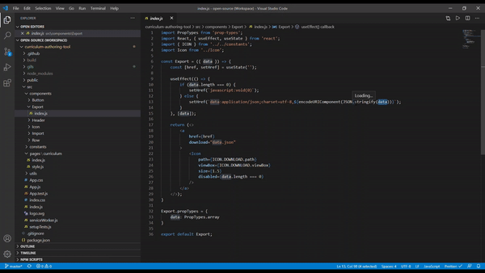

# Curriculum Authoring tool

A tool for teachers to author curriculum for a subject

## Demo

URL - https://curriculum-tool.netlify.app/

(Click on below gif's to see full video)

#### Application Demo

#### Project Structure

#### Project Architecture

## Installation

Pre-requisite: Either have  or  installed in your machine globally

After cloning the repository, follow the following steps to run application -

- Install all dependencies - Run `yarn install` || `npm install` in cmd in project directory
- Then, start the application with command - `yarn start` || `npm start`
